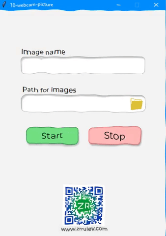

# webcam-with-python
* The project was made with `Python`, `Figma`, `Tkinter`, `Tkinter-Design-Master` and other libraries.
* You can run `webcam-picture.exe` file on Windows PC. 
* It takes 10 pictures in one cycle.
* If you want to customize you can use `webcam-picture.py` file.
* To make `.exe` file I used `auto-py-to-exe` 
* You can install `auto-py-to-exe` package in <a href="https://pypi.org/project/auto-py-to-exe/">here...</a>
* 
* 
